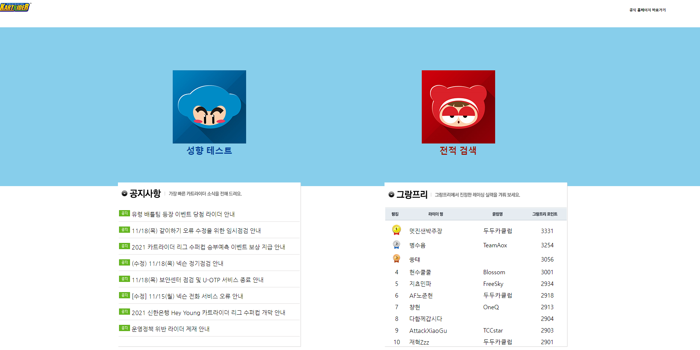
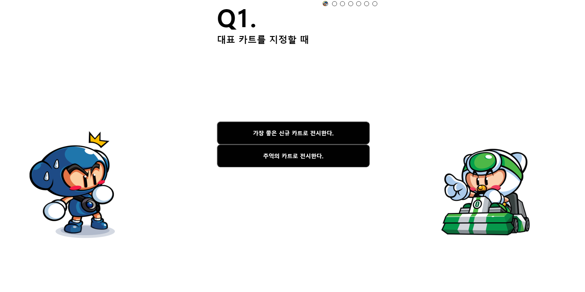
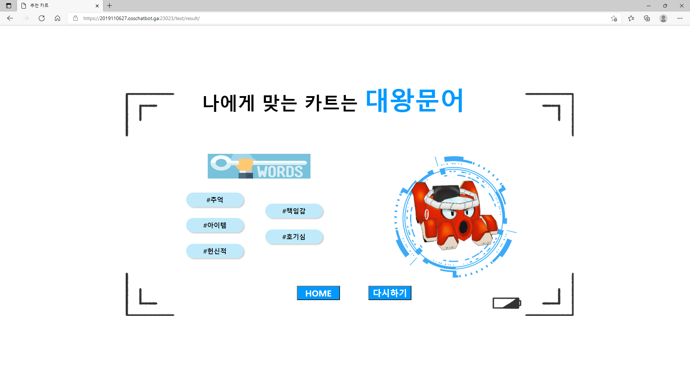
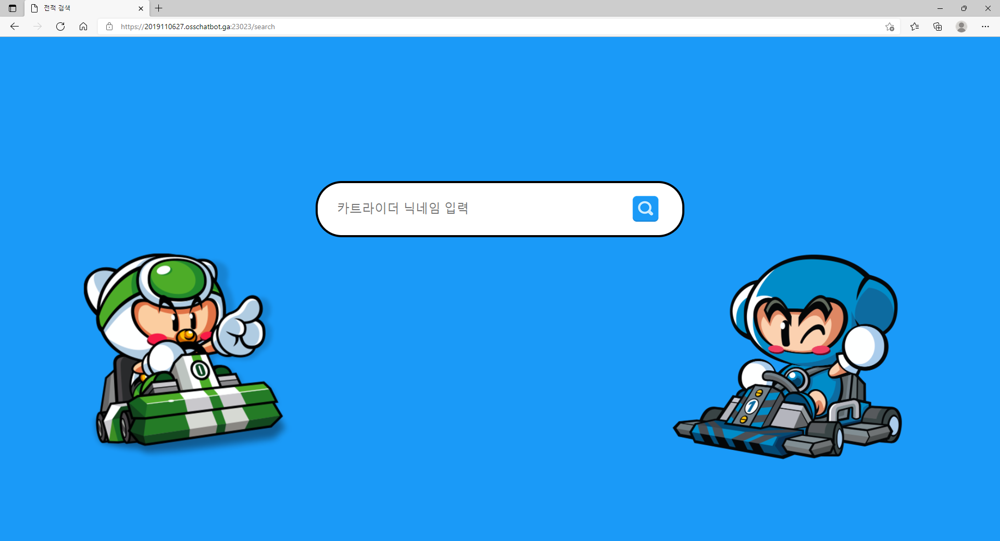
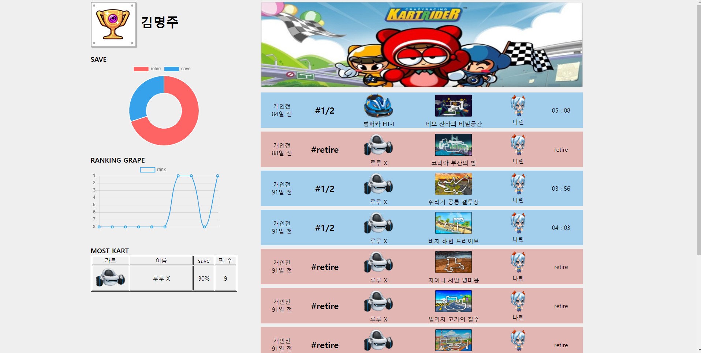

<!--
*** Thanks for checking out the Best-README-Template. If you have a suggestion
*** that would make this better, please fork the repo and create a pull request
*** or simply open an issue with the tag "enhancement".
*** Don't forget to give the project a star!
*** Thanks again! Now go create something AMAZING! :D
-->

<!-- PROJECT SHIELDS -->
<!--
*** I'm using markdown "reference style" links for readability.
*** Reference links are enclosed in brackets [ ] instead of parentheses ( ).
*** See the bottom of this document for the declaration of the reference variables
*** for contributors-url, forks-url, etc. This is an optional, concise syntax you may use.
*** https://www.markdownguide.org/basic-syntax/#reference-style-links
-->
[![Contributors][contributors-shield]][contributors-url]
[![Forks][forks-shield]][forks-url]
[![Stargazers][stars-shield]][stars-url]
[![Issues][issues-shield]][issues-url]
[![MIT License][license-shield]][license-url]
[![LinkedIn][linkedin-shield]][linkedin-url]

<!-- PROJECT LOGO -->
 

  <h2 align="center">KGG(Kartrider God Game)</h2>
  
전적 검색과 성향 테스트 결과에 따른 카트 추천

<!-- TABLE OF CONTENTS -->

  
Table of Contents

  <ol>
    <li><a href="#about-the-project">About The Project</a></li>
    <li><a href="#roadmap">Roadmap</a></li>
    <li><a href="#license">License</a></li>
    <li><a href="#contact">Contact</a></li>
    <li><a href="#reference">Reference</a></li>
  </ol>

<!-- ABOUT THE PROJECT -->
## About The Project

카트라이더는 넥슨에서 서비스 하는 레이싱 비디오 게임이다. 2004년 부터 서비스를 하고 있지만 lol과 다르게 전적 검색 사이트가 많이 존재하지 않는다.

카트라이더의 홍보와 경쟁전(개인전)에서 전적이 궁금한 사람들을 위해 개발한 웹 서비스이다.

이 웹 사이트는 다음과 같은 서비스를 제공하고 있다.
* 닉네임을 통한 전적 검색(개인전, 그랑프리, 개인 무한부스터에 대한 결과 제공)
* 7가지 질문을 통한 카트바디 추천
* 그랑프리 랭킹
* 카이라이더 공지 사항 및 업데이트

(<a href="#top">back to top</a>)

### Built With

List frameworks/libraries in my project.

* [Spring](https://spring.io/)
* [Hibernate](https://hibernate.org/)
* [EJS](https://ejs.co/)
* [JQuery](https://jquery.com)

(<a href="#top">back to top</a>)

<h4>🏸 HOME PAGE</h4>

 
<h4>🏸 RECOMMEND PAGE</h4>

 
<h4>🏸 SEARCH PAGE</h4>

(<a href="#top">back to top</a>)

<!-- ROADMAP -->
## Roadmap

- [x] Add back to top links
- [x] Deploy (Use AWS) [2022. 01. 01 : 서비스 임시 종료]
- [x] Add Home page
- [x] Add Additional Templates
- [x] Add "components" document to easily copy & paste sections of the readme
- [ ] Multi-language Support
    - [x] Korean
    - [ ] Chinese
    - [ ] Spanish

(<a href="#top">back to top</a>)

<!-- LICENSE -->
## License

METADATA : It's owned by Nexon(Kartrider)

(<a href="#top">back to top</a>)

<!-- CONTACT -->
## Contact

김명주 - mjoo1106@naver.com  
김민재 - minjaei23@gmail.com

(<a href="#top">back to top</a>)

<!-- REFERENCE -->
## Reference

* [Use kartrider api](https://developers.nexon.com/kart/guides)

(<a href="#top">back to top</a>)

<!-- MARKDOWN LINKS & IMAGES -->
<!-- https://www.markdownguide.org/basic-syntax/#reference-style-links -->
[contributors-shield]: https://img.shields.io/github/contributors/othneildrew/Best-README-Template.svg?style=for-the-badge
[contributors-url]: https://github.com/othneildrew/Best-README-Template/graphs/contributors
[forks-shield]: https://img.shields.io/github/forks/othneildrew/Best-README-Template.svg?style=for-the-badge
[forks-url]: https://github.com/othneildrew/Best-README-Template/network/members
[stars-shield]: https://img.shields.io/github/stars/othneildrew/Best-README-Template.svg?style=for-the-badge
[stars-url]: https://github.com/othneildrew/Best-README-Template/stargazers
[issues-shield]: https://img.shields.io/github/issues/othneildrew/Best-README-Template.svg?style=for-the-badge
[issues-url]: https://github.com/othneildrew/Best-README-Template/issues
[license-shield]: https://img.shields.io/github/license/othneildrew/Best-README-Template.svg?style=for-the-badge
[license-url]: https://github.com/othneildrew/Best-README-Template/blob/master/LICENSE.txt
[linkedin-shield]: https://img.shields.io/badge/-LinkedIn-black.svg?style=for-the-badge&logo=linkedin&colorB=555
[linkedin-url]: https://linkedin.com/in/othneildrew
[product-screenshot]: images/kart.png
[homepage]:images/homepage.png
[search]:images/search.png
[search_r]:images/search_r.png
[test]:images/test.png
[test_r]:images/test_r.png

